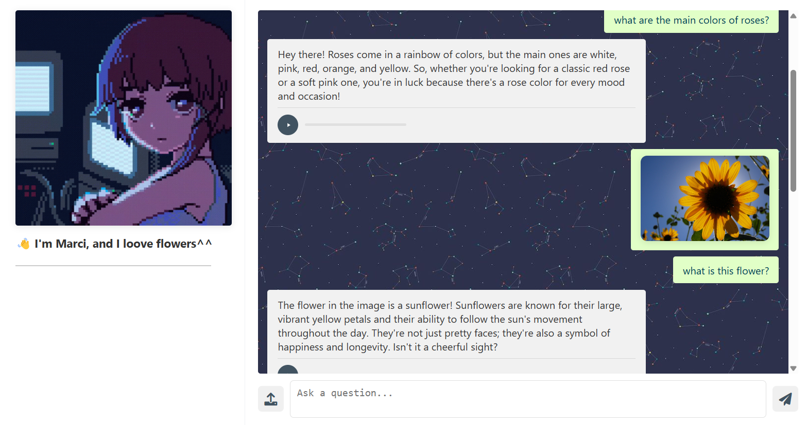

# Marci - Garden Expert

I built a graph agent for help you with your plants, she can see images by a vision classifier model and respond to your questions based on a web search, she is so funny and conversationable with its special chat memory, she can speak with you by her voice via TTS model.

*You can watch marci here.😊*

## Workflow

### 1. Router-Vision: Image Analysis for Flower Recognition

Mimicking human perception, Marci begins by processing visual input. A fine-tuned ResNet-18 network analyzes user-uploaded images, extracting the flower species. This label serves as the foundation for the chatbot (Marci's brain) to generate relevant responses.

### 2. Chatbot Decision Logic: Implementing the REACT Pattern

Marci's decision-making process utilizes the REACT pattern to dynamically choose between direct responses and information retrieval. When a search is deemed necessary, the LLM constructs an optimized search query based on the user's input. The resulting data is then integrated and refined, allowing the LLM to provide a comprehensive and informed answer to the user.

### 3. Contextual Memory: Selective Clipping and LLM Summarization

Marci's response generation incorporates a mechanism for managing conversation history. When the message count surpasses two, the system retains the most recent two messages in their original form. The older messages are then processed by the LLM to create a concise summary, ensuring relevant context is maintained without exceeding memory constraints.
